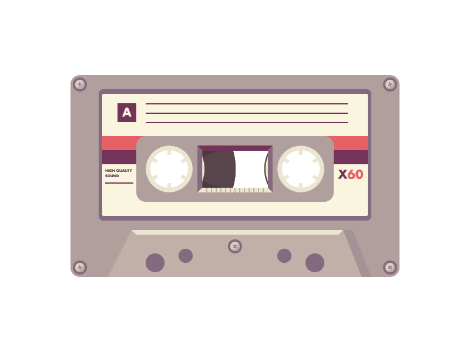

[
](https://coveralls.io/r/studio-b12/tape-css)
 [
](https://travis-ci.org/studio-b12/tape-css)
 [
](https://david-dm.org/studio-b12/tape-css)
 [
](https://nodejs.org/api/documentation.html#documentation_stability_index)
 [
](https://github.com/airbnb/javascript)


<div                                                         id="/">&nbsp;</div>

tape-css
========

**CSS unit testing. Ligtening-fast. tape-style.**

Isolates DOM and styles for ligtening-fast unit testing. As elegant and lightweight as *[tape][]* itself.

[tape]:        https://www.npmjs.com/package/tape


<p align="center"><a
  title="Graphic by the great Justin Mezzell"
  href="http://justinmezzell.tumblr.com/post/91142673693"
  >
  <br/>
  <br/>
  
  <br/>
  <br/>
</a></p>


<div                                             id="/installation">&nbsp;</div>

Installation
------------

```sh
$ npm install tape-css
```


<div                                                    id="/usage">&nbsp;</div>

Usage
-----

######  1

Pick your favorite flavor of *[tape][]* – be it *[tape][]* itself, *[tape-catch][]*, *[blue-tape][]* or whatever.

```js
const tape = require('tape');
const test = require('tape-css')(tape);  // We don’t change `tape` in any way.
```

[tape-catch]:  https://www.npmjs.com/package/tape-catch
[blue-tape]:   https://www.npmjs.com/package/blue-tape

######  2

Pass the DOM tree and styles you want to test. We’ll add it to the `<body>`[&ast;](https://github.com/studio-b12/tape-css/issues/1) before your test and clean up right after your test has ended.

```js
test('Roses are red, <span>s are blue', {
  dom: document.createElement('span'),
  styles: '* { color: red; } span { color: blue; }',
}, (t) => {
  // Our span and styles are here to play with.
  t.equal(
    getComputedStyle(document.querySelector('span')).getPropertyValue('color'),
    'rgb(0, 0, 255)'
  );

  t.end();
  // We’ve now cleaned up the place!
});
```

######  3

*tape-css* is made to play well with other tools. *[hyperscript][]* can make your tests nicer to read and write:

```js
const h = require('hyperscript');
const firstRose = h('div.dog');
const secondRose = h('div.dog');

test('Every dog has some space to breathe', {
  dom: h('div', [firstRose, secondRose]),
  style: '.dog { margin-bottom: 10px; }',
}, (is) => {
  is.equal(
    secondRose.getBoundingClientRect().bottom -
    firstRose.getBoundingClientRect().top,
    10,
    '10 px dog to dog'
  );

  is.end();
})
```

[hyperscript]:   https://www.npmjs.com/package/hyperscript

######  4

Whenever you want to see how your layout actually looks like, use `test.only`. We’ll only execute this one test and we won’t clean up afterwards. That’s pretty useful while debugging.

```js
test('All is well', /* … */);
test.only('Need to debug this', /* … */);
test('Works alright', /* … */);
```


API
---

If you use tape, you’ll feel right at home. We don’t change [the API][] in any way.

We add two options to the `test` function:

* `dom` – an Element or DocumentFragment. We’ll add it to the `<body>` before your test and clean it up after your test has ended. Default: nothing.

* `styles` – a string of CSS. We’ll add it as a `<style>` to the `<head>` before your test – and clean it up after your test has ended. Default: nothing.

[the API]:     https://github.com/substack/tape#methods


<div                                                  id="/license">&nbsp;</div>

License
-------

[MIT][] © [Studio B12 GmbH][]

[MIT]:              ./License.md
[Studio B12 GmbH]:  http://studio-b12.de
