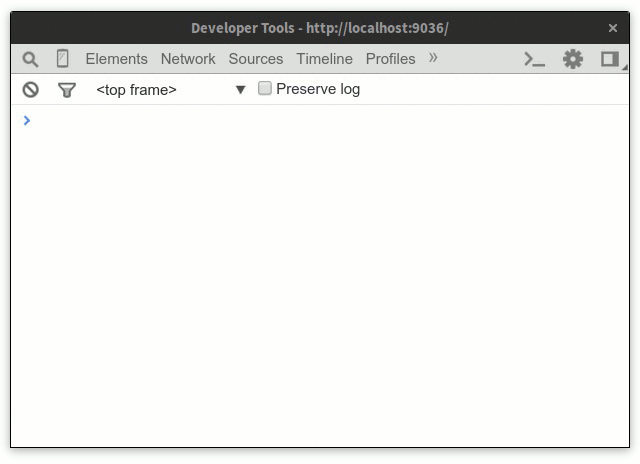

[](https://coveralls.io/r/studio-b12/tape-css
) [](https://travis-ci.org/studio-b12/tape-css
) [](https://david-dm.org/studio-b12/tape-css
) [](https://github.com/studio-b12/tape-css/milestones/1.0
) [](https://github.com/airbnb/javascript
)


<h1                                                              align="center">
  
</h1>


<p                                                                    ><br/></p>

<h4                                                      align="center"><strong>
  CSS unit testing. Lightning-fast. <em><a href="https://www.npmjs.com/package/tape">tape</a></em>-style.
</strong></h4>

<p                                                               align="center">
  Isolates DOM and styles for reproducible unit tests. As elegant and lightweight as <em><a href="https://www.npmjs.com/package/tape">tape</a></em> itself.
</p>


<a                                                          id="/demo"></a><br/>

Demo
----

<p align="center">
  <br/>
  <br/>
  
  <br/>
  <sup>
    That’s how <em><a href="https://www.npmjs.com/package/budo">budo</a></em> + <em><a href="https://www.npmjs.com/package/tap-dev-tool">tap-dev-tool</a></em> + <em>tape-css</em> play together. Other great options: <em><a href="https://www.npmjs.com/package/hihat">hihat</a></em>, <em><a href="https://www.npmjs.com/package/testron">testron</a></em>.
  </sup>
  <br/>
  <sup>
    <a href="#/performance">Looks slow?</a>
  </sup>
</p>


<a                                                  id="/installation"></a><br/>

Installation
------------

```sh
$ npm install tape-css
```


<a                                                         id="/usage"></a><br/>

Usage
-----

######  1

Pick your favorite flavor of *[tape][]* – be it *[tape][]* itself, *[tape-catch][]*, *[blue-tape][]* or whatever.

```js
const tape = require('tape');
const test = require('tape-css')(tape);  // We don’t change `tape` in any way.
```

[tape]:        https://www.npmjs.com/package/tape
[tape-catch]:  https://www.npmjs.com/package/tape-catch
[blue-tape]:   https://www.npmjs.com/package/blue-tape

######  2

Pass the DOM tree and styles you want to test. We’ll add it to the `<body>`[\*](https://github.com/studio-b12/tape-css/issues/1) before your test begins – and clean them up right after it has ended.

```js
test('Roses are red, <span>s are blue', {
  dom: document.createElement('span'),
  styles: '* { color: red; } span { color: blue; }',
}, (t) => {
  // Our span and styles are here to play with.
  t.equal(
    getComputedStyle(document.querySelector('span')).getPropertyValue('color'),
    'rgb(0, 0, 255)'
  );

  t.end();
  // We’ve now cleaned up the place!
});
```

######  3

*tape-css* is made to play well with other tools. *[hyperscript][]* and *[computed-style][]* can make your tests nicer to read and write:

```js
const h = require('hyperscript');
const style = require('computed-style');
const personOne = h('.person');
const personTwo = h('.person');

test('Everyone has some space to breathe', {
  dom: h('div', [personOne, personTwo]),
  styles: '.person { margin-bottom: 10px } * { padding: 5px }',
}, (is) => {
  is.equal(
    personTwo.getBoundingClientRect().bottom -
    personOne.getBoundingClientRect().top,
    10,
    '10 px between people'
  );

  is.equal(
    style(personOne, 'padding-right'),
    '5px',
    'one has room to move his arm'
  );

  is.end();
})
```

[hyperscript]:      https://www.npmjs.com/package/hyperscript
[computed-style]:   https://www.npmjs.com/package/computed-style

######  4

Whenever you want to see how your layout actually looks like, use `test.only`. We’ll only execute this one test and we won’t reset the DOM and styles afterwards. That’s pretty useful while debugging.

```js
test('All is well', /* … */);
test.only('Need to debug this', /* … */);
test('Works alright', /* … */);
```


<a                                                   id="/performance"></a><br/>

Performance
-----------

Does [928 ms for 21 tests](#/screencast) look slow to you? We thought so as well – so we wanted to check why. We created 400 specs with 1000 assertions to check that. Every spec had its own DOM tree and style element created, injected and cleaned up (4 operations per spec). We run and timed that a couple of times in the very same Chrome you’re seeing in the screencast.

Running it took 3 seconds ±200 ms. That’s over 330 tests and 500 DOM operations per second!

***tape-css* just feels lightening-fast.**

It turns out much of the measured time is just the browser rendering the initial page. We tried to time how much that takes – we got wildly differing results though. Feel free to submit a PR if you manage to work this out.


<a                                                           id="/api"></a><br/>

API
---

<!-- @doxie.inject start -->
<!-- Don’t remove or change the comment above – that can break automatic updates. -->
<div align="right"><sub>JSIG SIGNATURE <a href="http://jsig.biz/">(?)</a></sub></div>
```js
test(tape) => (
  name?        : String,
  options?: {
    // All original `tape` options, and:
    dom?       : Element | DocumentFragment
    styles?    : String
    document?  : Document
  },
  callback     : Function
) => void
```

If you use tape, you’ll feel right at home. Give us an instance of `tape`.
We won’t change its [existing API][] in any way. We just add a couple
of `options`:

- `dom` – one or more DOM elements. We’ll add it to the `<body>`
  before your test and clean it up after your test has ended.
  Default: nothing.

- `styles` – a string of CSS. We’ll add it as a `<style>` to the `<head>`
  before your test – and clean it up after your test has ended.
  Default: nothing.

- `document` – a custom implementation of `document`. It may be useful
  for testing outside a browser. Default: `window.document`.

[existing API]:     https://github.com/substack/tape#methods
<!-- Don’t remove or change the comment below – that can break automatic updates. More info at <http://npm.im/doxie.inject>. -->
<!-- @doxie.inject end -->


<a                                                       id="/credits"></a><br/>

Credits
-------

This module was inspired by *[quixote](https://github.com/jamesshore/quixote)*. Thumbs up for the great idea [@jamesshore](https://github.com/jamesshore)!

It turned out that *quixote* wasn’t easy to use with *tape* though. As well as that, it comes with heavy abstractions (over 3K lines of code) and its own assertion engine – while everything you need for assertions comes with *tape* already.

We were after something simple which does one thing (<50 LOC last time we checked). And plays well with other simple tools.


<a                                                       id="/license"></a><br/>

License
-------

[MIT][] © [Studio B12 GmbH][]

[MIT]:              ./License.md
[Studio B12 GmbH]:  http://studio-b12.de
